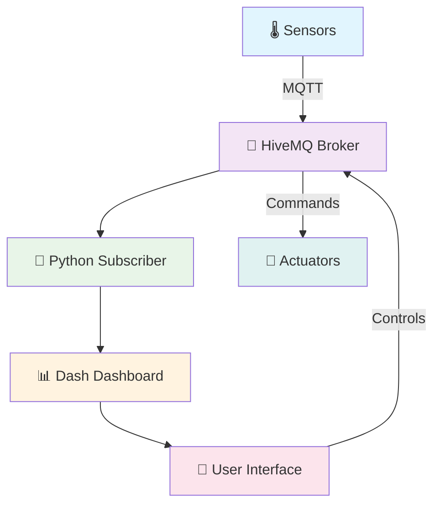

<div align="center">
 
# 🌱 Greenhouse Sensor Dashboard 🌱
 

 
[](https://python.org)
[](https://mqtt.org)
[](https://dash.plotly.com)
[](https://getbootstrap.com)
 

 
</div>
 
---
 
## 🚀 **Project Overview**
 
> **Transform your greenhouse into a smart, connected ecosystem!**
 
This project creates a comprehensive **IoT monitoring and control system** for greenhouse management using MQTT protocol, real-time data visualization, and interactive web controls.
 
<div align="center">
 

 
</div>
 
---
 
## ✨ **Key Features**
 
<table>
<tr>
<td width="50%">
 
### 📊 **Real-Time Monitoring**
- 🌡️ **Temperature** tracking
- 💧 **Humidity** levels
- 🌱 **Soil moisture** monitoring  
- ☀️ **Light intensity** measurement
- 📈 **Historical data** visualization
 
</td>
<td width="50%">
 
### 🎛️ **Smart Controls**
- 💦 **Sprinkler system** control
- 🌪️ **Fan** operation
- 💡 **Lighting** management
- 🔥 **Heater** control
- 🔄 **Real-time** command execution
 
</td>
</tr>
</table>
 
---
 
## 🖼️ **Screenshots & Demo**
 
<div align="center">
 
### 📱 **Dashboard Overview**

 
### 📊 **Real-Time Charts**

 
### 🎛️ **Control Panel**

 
### 🔄 **Live Data Updates**

 
### 📈 **Historical Trends**

 
### 🖥️ **Terminal Output**

 
</div>
 
---
 
## 🏗️ **Architecture**
 
<div align="center">
 
```ascii
┌─────────────────┐    ┌─────────────────┐    ┌─────────────────┐
│   🌡️ Sensors    │───▶│  📡 MQTT Broker │◀───│  🎛️ Controls    │
│                 │    │  (HiveMQ Cloud) │    │                 │
│ • Temperature   │    │                 │    │ • Sprinkler     │
│ • Humidity      │    │ Topics:         │    │ • Fan           │
│ • Soil Moisture │    │ greenhouse/*    │    │ • Lights        │
│ • Light Level   │    │                 │    │ • Heater        │
└─────────────────┘    └─────────────────┘    └─────────────────┘
         │                       │                       ▲
         │                       ▼                       │
         │              ┌─────────────────┐              │
         │              │ 🐍 Python Apps  │              │
         │              │                 │              │
         │              │ mqtt_subscriber │──────────────┘
         │              │ mqtt_ui.py      │
         │              └─────────────────┘
         │                       │
         │                       ▼
         │              ┌─────────────────┐
         └─────────────▶│ 📊 Dash Web UI  │
                        │                 │
                        │ • Live Charts   │
                        │ • Control Panel │
                        │ • Bootstrap UI  │
                        └─────────────────┘
```
 
</div>
 
---
 
## 🛠️ **Tech Stack**
 
<div align="center">
 
| Component | Technology | Purpose |
|-----------|------------|---------|
| 🔗 **Communication** | MQTT Protocol | Real-time messaging |
| 🌐 **Broker** | HiveMQ Cloud | Message routing |
| 🐍 **Backend** | Python 3.8+ | Data processing |
| 📊 **Visualization** | Plotly Dash | Interactive charts |
| 🎨 **Frontend** | Bootstrap 5.3 | Responsive UI |
| 📡 **MQTT Client** | Paho MQTT | Python MQTT library |
| 🔄 **Threading** | Python Threading | Concurrent operations |
 
</div>
 
---
 
## 📦 **Installation**
 
<details>
<summary><b>🔽 Click to expand installation steps</b></summary>
 
### 1️⃣ **Clone the Repository**
```bash
git clone https://github.com/YOUR_USERNAME/YOUR_REPO_NAME.git
cd YOUR_REPO_NAME
```
 
### 2️⃣ **Install Dependencies**
```bash
pip install -r requirements.txt
```
 
**Or install manually:**
```bash
pip install paho-mqtt dash plotly dash-bootstrap-components
```
 
### 3️⃣ **Configure MQTT Settings**
Edit the broker settings in both files if needed:
```python
broker = "broker.hivemq.com"
port = 1883
```
 
</details>
 
---
 
## 🚀 **Quick Start**
 
<div align="center">
 
### 🎯 **Option 1: Run Dashboard Only**
```bash
python mqtt_ui.py
```
**Then open:** `http://localhost:8050`
 
### 🎯 **Option 2: Run Subscriber Only**
```bash
python mqtt_subscriber.py
```
 
### 🎯 **Option 3: Run Both (Recommended)**
```bash
# Terminal 1
python mqtt_subscriber.py
 
# Terminal 2  
python mqtt_ui.py
```
 
</div>
 
---
 
## 📋 **MQTT Topics**
 
<div align="center">
 
| Topic | Data Type | Example | Description |
|-------|-----------|---------|-------------|
| `greenhouse/humidity` | Float | `65.2` | Humidity percentage |
| `greenhouse/temperature` | Float | `24.5` | Temperature in Celsius |
| `greenhouse/soilMoisture` | String | `Moist` | Soil condition |
| `greenhouse/lightIntensity` | String | `Bright` | Light level |
| `greenhouse/control` | String | `sprinkler_on` | Control commands |
 
</div>
 
---
 
## 🎮 **Usage Examples**
 
<details>
<summary><b>📡 Publishing Sensor Data</b></summary>
 
```python
import paho.mqtt.client as mqtt
 
client = mqtt.Client()
client.connect("broker.hivemq.com", 1883, 60)
 
# Publish sensor readings
client.publish("greenhouse/temperature", "25.3")
client.publish("greenhouse/humidity", "68.5")
client.publish("greenhouse/soilMoisture", "Dry")
client.publish("greenhouse/lightIntensity", "Medium")
```
 
</details>
 
<details>
<summary><b>🎛️ Sending Control Commands</b></summary>
 
```python
# Turn on sprinkler
client.publish("greenhouse/control", "sprinkler_on")
 
# Turn on fan
client.publish("greenhouse/control", "fan_on")
 
# Turn on lights
client.publish("greenhouse/control", "lights_on")
 
# Turn on heater
client.publish("greenhouse/control", "heater_on")
```
 
</details>
 
---
 
## 🔧 **Configuration**
 
<div align="center">
 
### ⚙️ **Customizable Settings**
 
| Setting | File | Default | Description |
|---------|------|---------|-------------|
| Update Interval | `mqtt_ui.py` | 2000ms | Dashboard refresh rate |
| History Length | `mqtt_ui.py` | 50 points | Chart data points |
| MQTT Broker | Both files | `broker.hivemq.com` | MQTT server |
| Port | Both files | `1883` | MQTT port |
 
</div>
 
---
 
## 📊 **Features Breakdown**
 
<table>
<tr>
<td width="33%">
 
### 🔄 **Real-Time Updates**
- Live sensor data streaming
- 2-second refresh intervals
- Automatic reconnection
- Error handling & recovery
 
</td>
<td width="33%">
 
### 📈 **Data Visualization**
- Interactive Plotly charts
- Historical trend analysis
- Responsive design
- Color-coded metrics
 
</td>
<td width="33%">
 
### 🎛️ **Control System**
- One-click device control
- MQTT command publishing
- Status feedback
- Bootstrap styling
 
</td>
</tr>
</table>
 
---
 
## 🤝 **Contributing**
 
<div align="center">
 
We welcome contributions! Here's how you can help:
 
[](http://makeapullrequest.com)
 
</div>
 
1. 🍴 **Fork** the repository
2. 🌿 **Create** a feature branch (`git checkout -b feature/AmazingFeature`)
3. 💾 **Commit** your changes (`git commit -m 'Add some AmazingFeature'`)
4. 📤 **Push** to the branch (`git push origin feature/AmazingFeature`)
5. 🔄 **Open** a Pull Request
 
---
 
## 📄 **License**
 
<div align="center">
 
This project is licensed under the **MIT License** - see the [LICENSE](LICENSE) file for details.
 
[](https://opensource.org/licenses/MIT)
 
</div>
 
---
 
## 🙏 **Acknowledgments**
 
<div align="center">
 
- 🌐 **HiveMQ** for free MQTT broker service
- 📊 **Plotly Dash** for amazing visualization framework
- 🎨 **Bootstrap** for beautiful UI components
- 🐍 **Paho MQTT** for reliable Python MQTT client
 
</div>
 
---
 
<div align="center">
 
## 🌟 **Show Your Support**
 
If this project helped you, please consider giving it a ⭐!
